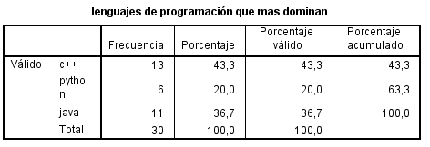
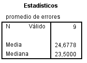

```{r setup, include=FALSE}
knitr::opts_chunk$set(echo = TRUE)

library(tidyverse)
library(dplyr)
setwd('~/sistemas/statistics/test/')
data <- read.csv("base.txt", head=TRUE, sep="")
getMode <- function(codes){
  which.max(tabulate(codes))
}
```

## Sección 01
1. Para poder aplicar una función a un vector en R:
  **a) Se debe declarar como una función vectorial.**
2. Genera el código que reportaría este gráfico (col = 'lightblue'). Además, reporta e
interpreta la media, mediana, y moda.
```{r echo=F}
vec<-c(0,0,6,8,10,10,13,13,13,13,14,14,15,15,16,17,18,19,20,20)
barplot(table(vec), col = 'lightblue')
summary(vec)
tab <- table(vec)
names(tab)[which(tab==max(tab))]
```
+ el promedio de los datos es **12.70***
+ la mitad de los números de datos están por debajo de  **13.50*** y la otra mitad está sobre el **13.50***
+ El valor con mas frecuencia es  **13***


3. Completa lo siguiente:
Datos, Información, ……………………...., ……………………………..

4. ¿Cuál área se encarga del estudio de la aleatoriedad e incerteza?
**Estadística inferencial**

5. La estadística descriptiva utiliza métodos para recolectar, organizar, presentar y
analizar datos obtenidos de una **Población** o **Muestra**.

6. ¿Qué estadístico no tiene la misma medida que los datos originales?

This is an R Markdown document. Markdown is a simple formatting syntax for 

## Sección 2

a) Calcula la media, la mediana y la moda (con 2 decimales) de las “NOTAS”,
tanto de forma conjunta como por “ESTUDIO”.
- Forma conjunta
```{r echo=F}
summary(data$nota)
```

- Forma agrupada
```{r echo=F}
data %>%
  group_by(estudio) %>%
summarise(
'Media' = mean(nota),
'Mediana' = median(nota),
'Moda'=getMode(nota),
'Desviacion estandar' = sd(nota),
)
```

¿En qué grupo observas la nota más alta? : 
**en el grupo de estadistica**.

¿Qué grupo está por encima de la media?: 
**Informática**.


b) ¿En qué grupo hay más variación de notas? Justifica tu respuesta.
**En el grupo de estadística, por que en este grupo existe notas mas alejadas que otras**
c) Crea en un solo gráfico los 4 diagramas de caja (boxplot), uno por grupo.
Agrega la nota promedio, coloca nombre, título y color al gráfico. (usar la
función BOXPLOT de R Studio)
```{r}
estud = data$estudio
class(data$estudio)
#data$estudio <- factor(data$estudio)
datos = data
##boxplot(datos ~ estud, main="hola")
```
d) ¿Observas valores atípicos en el boxplot anterior? ¿A qué grupo pertenece?
e) Indica a partir del boxplot generado en qué grupo existe más variedad de
notas.
f) Respecto a los reportes anteriores, ¿Puedes afirmar, estadísticamente, que
la evaluación ha ido mejor en algún estudio?


## Sección

```{r cars}
summary(cars)
```

## Including Plots

1. Identifica el tipo de variable estadística y su clasificación según su naturaleza

| Variable       | Tipo de variable     | Clasificación     |
| :------------- | :----------: | -----------: |
| 1. Número de proyectos concluidos |   Cuantitativa |  discreta   |
| 2. Nivel de satisfacción de un sistema   | cualitativa  | ordinal  |
| 2. Valor un dato tipo double   | cuantitativa  |  continua |
| 4. Sucursal de consultoras   | cualitativas | nominales  |
| 5. Tipos de lenguajes de programación   | cualitativas |  ordinales |
| 6. Tiempo de respuesta de una consulta de BD   | cuantitativa  |  continua |

2. Los siguientes datos provienen del resultado de entrevistar a 30 profesionales de
la carrera de ingeniería de sistemas sobre el lagunaje de programación que más
dominan.


1. Tabla de discribución de frecuencia

2. gráfico

- **C++ es el leguaje de programacion de mas dominio**
- **python es el leguaje de programacion de menos dominio**

3. En la siguiente tabla se muestran los resultados en promedio de los errores
identificados en sistemas elaborados por las sucursales de la empresa Technology.


- Utilizando los conocimientos sobre las medidas de tendencia central:

- el valor promedio de los promedio de errores es **24,6** 
-  gráfico histograma.


>> `Raul Jonatan tola choque` 8vo ciclo
